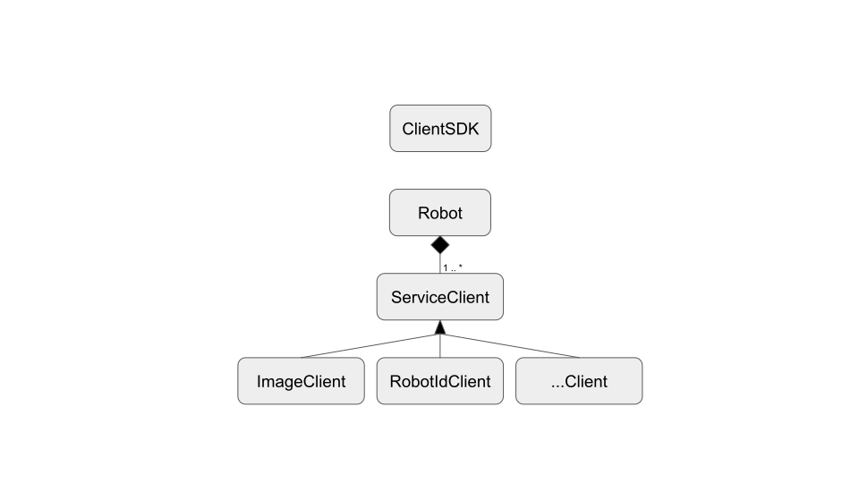

<!--
Copyright (c) 2023 Boston Dynamics, Inc.  All rights reserved.

Downloading, reproducing, distributing or otherwise using the SDK Software
is subject to the terms and conditions of the Boston Dynamics Software
Development Kit License (20191101-BDSDK-SL).
-->

# C++ SDK differences from Python SDK

This document describes the key differences between the Spot C++ SDK and the Spot Python SDK.

<!--ts-->
  * [RPC method return types](#rpc-method-return-types)
  * [Error checking](#error-checking)
  * [Object ownership](#object-ownership)
  * [Client-Server asynchronous communication](#client-service-asynchronous-communication)
<!--te-->

## RPC method return types

### No exceptions

The C++ client classes do not throw exceptions for any errors detected during the gRPC communication or internal errors. Instead, methods return `Status` objects that include successful and failure return types. The `Status` class is described in the section below.

### Status class and error codes 

The `Status` class is used in the Spot C++ SDK as the return type for methods that need to return a success condition with additional error information. It contains an `std::error_code` field and a string message. The string message field contains a human-readable message to be used for logging and additional details for failure returns. The `std::error_code` field specifies a code for success or failures. There are two types of `std::error_code` defined in the C++ SDK:
- Manually defined: These are `std::error_code` definitions that do not depend on protobuf definitions in the Spot API. Examples of this type of `std::error_code` in the SDK are: `RPCErrorCode` used for gRPC return types, `LeaseWalletErrorCode` used for lease wallet return types, and many more.
- Auto-generated from protobuf Status enumerations. These are all associated in the `ResponseError` condition described below.

All these error codes in the `std::error_code` field are organized in three error type `std::error_condition` conditions (`ResponseError`, `RPCError`, `SDKError`), and one success type `std::error_condition` condition.

- `ResponseError`: This `ErrorTypeCondition` condition groups all the error codes that correspond to the status definitions in most of the protobuf response messages, with the exception of feedback responses. The C++ SDK automatically converts status protobuf definitions to `std::error_code` definitions through macros and organizes all of them under the `ResponseError` `std::error_condition`.

- `RPCError`: This `ErrorTypeCondition` condition groups status returns from gRPC. It contains codes that correspond to exception class definitions in the Python SDK that are derived from the `RPCError` exception class.

- `SDKError`: This `ErrorTypeCondition` condition groups `std::error_code` codes defined in various parts of the SDK classes, including directory helper, client creation, lease wallet, time sync, docking and various error checking functionality.

- `Success`: This `SuccessCondition` condition is used to determine whether any of the `std::error_code` defined the C++ SDK represent a success or failure. This `std::error_condition` definition enables the `Status` class to overload the bool operator, so applications can easily check for success or failure returns from the SDK methods.

### Result struct

SDK methods that need to return a `Status` value as well as an object do so by returning a `Result` struct. This struct combines a `Status` field with a templatized `response` field. Most client RPC methods return a `Result` struct, templatized with the protobuf response definition for the RPC. This struct is similar in functionality to the proposed `std::expected` and `boost::outcome::result`.

## Error checking

The `Result` and `Status` objects defined in the section above contain an overloaded bool operator. So, developers can easily check for successful returns by the SDK methods:

`Result` return example that creates a `Robot` object from a `ClientSDK` object:
```
Result<std::unique_ptr<Robot>> robot_result = client_sdk->CreateRobot("spot_robot");
if (!robot_result) {
    std::cerr << "Could not create robot; error: " << robot_result.status.DebugString() << std::endl;
    return 0;
}
std::unique_ptr<Robot> robot = robot_result.move();
```

`Status` return example that authenticates the `Robot` object created in the code above:
```
Status status = robot->Authenticate("username", "password");
if (!status) {
    std::cerr << "Could not authenticate with robot; error: " << status.DebugString() << std::endl;
    return 0;
}
```

The hierarchy of error handling in the C++ SDK is as follows:
- `Result` bool operator simply returns the `Status` field in it, calling the `Status` bool operator.
- `Status` bool operator returns the value of `m_code == SuccessCondition::Success`, comparing its `std::error_code` to the `Success` `std::error_condition` described in the section [above](#status-class-and-error-codes).
- All `std::error_code` defined in the C++ SDK implement the `equivalent` method that returns success for the right enumeration value(s) that represent the success criteria. This process is described in more details below.


The `RPCErrorCode` defined for handling gRPC error codes contains this implementation of the `equivalent` method:
```
bool RPCErrorCodeCategory::equivalent(int valcode,
                                      const std::error_condition& cond) const noexcept {
    if (cond == SuccessCondition::Success) return (valcode == 0);
...
```

This means that the `RPCErrorCode` 0 (`Success = 0`) represents success, while all other enumeration values in `RPCErrorCode` represent failure.

In the case of auto-generated `std::error_code` from the protobuf status definitions, most client folders in bosdyn/client/ contain two files *error_codes.h/cpp. These files call macros to convert protobuf status definitions into `std::error_code` used by the `Status` class. The *error_codes.cpp files pass to the macros the success enumeration value that correspond to success criteria. For example, the `ImageClient` calls the macros with `valcode` 1:
`DEFINE_PROTO_ENUM_ERRORCODE_IMPL_API(ImageResponse_Status, valcode == 1)`

That means the `ImageResponse` status enumeration value 1 (`STATUS_OK = 1`) represent success, while all other enumeration values in `ImageResponse` status represent failure. Response status with value 1 represents success in most of the protobuf responses in the Spot API. Value 0 represents failure in most cases. There are also some responses with multiple success values. For example, the `PowerCommand` response status defines:
`DEFINE_PROTO_ENUM_ERRORCODE_IMPL_API(PowerCommandStatus, valcode == 1 || valcode == 2)`

That means the `PowerCommand` status enumeration values 1 (`STATUS_IN_PROGRESS = 1`) and 2 (`STATUS_SUCCESS = 2`) represent success, which all other enumeration values in `PowerCommand` status represent failure.

These details are handled under the hood in the C++ SDK, so that developers can simply utilize the bool operators in `Status` and `Result` to check for errors returned by the services or the SDK methods.

## Object ownership

There are two main object ownership levels in the Spot C++ SDK:


- The `ClientSDK` class is at the highest level, and it is used to generate one or many instances of the `Robot` class, with each representing a connection to a specific robot. The `ClientSDK` instance can be discarded after the `Robot` instances are created.

- The `Robot` class provides functionality to communicate with a specific robot. It is used to create client instances that communicate with specific gRPC services registered in the robot system. The recommended way to create a `Robot` instance in an application is to use the static method in the `ClientSDK` class:
```
Result<std::unique_ptr<::bosdyn::client::Robot>> CreateRobot(
    const std::string& network_address,
    const ProxyUseType& proxy_use = AUTO_DETERMINE,
    ::bosdyn::common::Duration timeout = kRPCTimeoutNotSpecified,
    std::shared_ptr<MessagePump> message_pump = nullptr);
```
That method returns a std::unique_ptr, so the application owns the `Robot` instance. This instance cannot go out-of-scope in the application while the service clients described below are still needed.

- The `ServiceClient` classes provide functionality to communicate with a specific service registered on a specific robot. The Spot C++ SDK contains a client implementation class derived from `ServiceClient` for each service defined in the Spot API. Each `ServiceClient` derived class implements the RPC methods corresponding to that service type. The recommended way to create `ServiceClient` instances in an application is to use the `EnsureServiceClient` methods in the `Robot` class:
```
Result<T*> EnsureServiceClient(
    const std::string& service_name,
    std::shared_ptr<grpc::ChannelInterface> channel = nullptr,
    std::shared_ptr<MessagePump> message_pump = nullptr);
```
For example, to create a `RobotIdClient` object in the application in order to communicate with the `RobotId` service running on the robot, simply call:
`Result<RobotIdClient*> robot_id_client_result = robot->EnsureServiceClient<::bosdyn::client::RobotIdClient>();`

The `Robot` instance caches the `ServiceClient` objects created from it, so applications do not accidentally create multiple clients to the same service. The `EnsureServiceClient` method returns a raw pointer to the cached `ServiceClient` instance owned by the `Robot` class. The application **should not delete** the `ServiceClient` raw pointers. This also means that the `ServiceClient` raw pointers **cannot outlive** the `Robot` instance.

## Client-Service asynchronous communication

All synchronous RPC methods in the C++ clients simply return the `.get()` call on the `std::shared_future` returned by the corresponding asynchronous RPC method. The full client functionality for the RPC methods is implemented in the asynchronous methods. The C++ SDK code also does not explicitly create new threads for communication over gRPC. The client methods utilize the gRPC [CompletionQueue](https://grpc.io/docs/languages/cpp/async/) to communicate asynchronously with the gRPC services. The internal gRPC client classes do create additional threads as part of the communication with the service-side.
